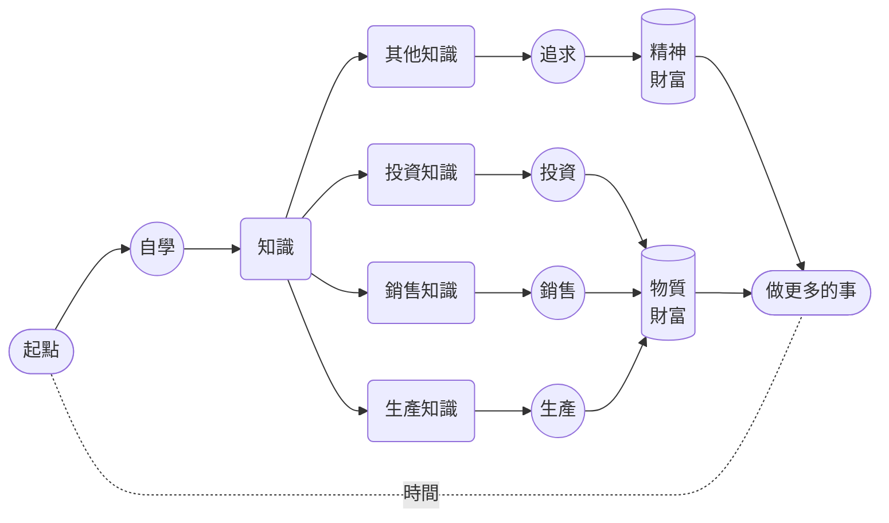

# 1. 用兵打仗

人們為教育從不吝於支付金錢…… 可惜的是，人們往往不願意為教育支付注意力 —— 英文的習慣用法很準確，**注意什麼東西**是 *pay attention to something*。

我們手裡通常有三種資源，**金錢**，**時間**，**注意力**。教育的本質是**投資**自我。天下的投資都一樣，投資就需要時間作為基本生產資料，不花時間的或者只花很少時間的不是**投資**，我們對這樣的行為有另外一個稱呼，叫作**投機**。

投資的時候，我們做的事情，本質上來看都一樣，其實是在**往時間裡傾注金錢**。如果採用定投策略的話，那就是**不斷往時間裡傾注金錢但絕不傾注注意力**。當我們學習的時候，或者說，當我們投資自我的時候，有個重點區別，我們要往**時間**裡傾注的也有**金錢**，但與此同時，更重要的是**注意力**。

從這個角度望過去，一切學習失敗的根源，無非以下兩種：

> * 花錢不花時間
> * 花時間不花注意力

到最後，所有的失敗都一樣，只不過都是因為**沒有往時間裡傾注足夠的注意力**而已。

人們總是誤以為決定學習成敗的關鍵在於智商，並且還總是誤以為智商這個東西是一成不變的。可實際上，這兩個觀點都是基於誤解的幻覺。

真正的決定性因素在於**注意力**。

 我有一個較為形象的說法。如果一個人可以做到持續 25 分鐘左右注意力集中，那麼，他就相當於是位**將軍**，**有兵可用**。一次持續 25 分鐘的注意力集中相當於一個兵。如果一個人在一整天的時間裡能做到若干次持續 25 分鐘的注意力集中，那就相當於**這位將軍有若干個兵可用**。

兵越多當然就越好。只不過一天裡的時間是有限的，與此同時，為了注意力集中大腦必需消耗大量的能量，所以，兵不可能無限多。然而，對絕大多數普通人來說，只要一天能帶上七八個兵，就能做很多事情，若是能夠持續下去，就一定能夠達成相當驚人的成績。

**有兵可用**之後要**有仗可打**。養兵靠打仗。沒仗可打，兵就會慢慢廢掉。只要兵在不斷地打仗，它就會變得更為強大，具體表現就是，從**可以持續 25 分鐘注意力集中**，發展成**可以持續 30 分鐘 40 分鐘甚至更長時間注意力集中**。兵當然越強越好。只要是強兵，用很少的兵也可以打很大的仗。

用強**兵**打什麼**仗**呢？學習就是用兵打仗，自學就是自己用兵打仗…… 我們這一輩子的絕大部分時間都應該用來**自學**。學什麼？學生產知識、學銷售知識、學投資知識 —— 用來創造物質財富，然後還要學很多其他知識 —— 用來追求精神財富，然後才能用時間做更多的事情。

遺憾的是，大多數人壓根就**無兵可用**，他們根本做不到持續 25 分鐘注意力集中。所以他們也不大可能是這個類比中的將軍。他們也**無仗可打**，所以他們也根本養不出兵…… 這跟智商或者天分沒有任何關係，手裡沒兵，再聰明都沒用。手裡有點兵但無仗可打，還是沒用，並且因為無仗可打，所以哪怕就那一點兵早晚還是會廢掉…… 還是一樣的，再聰明也沒用。

猜一猜最令人遺憾的事情是什麼？

> **每個人原本都有兵，並且還都是強兵**。

小朋友的注意力持續時間都很長，只要不被打擾，他們很容易被某個事物或者活動吸引，然後就會一直專注下去，除非餓了。

父母們往往並不知道要呵護自家孩子的注意力 —— 不管孩子在幹嘛，他們都可能隨時衝上去抱一下，親一下，只顧著滿足自己。學校也很可能是破壞大多數孩子注意力的幫兇，雖然肯定不是出於故意 —— 長期被迫坐在枯燥的課堂裡一口氣幾十分鐘，很多孩子並沒有學會注意力集中，真正練出來的是如何坐在那裡走神但不被發現。商品經濟已經演化成注意力經濟，全世界都在爭奪我們的注意力。最近十幾年興起的移動智慧裝置，把地球上絕大多數人的注意廣度（Attention Span）生生壓縮到了兩分鐘之內……

就這樣，大多數人逐步變成了徹底**無兵可用**、壓根**無仗可打**的人 —— 可無比遺憾的是，他們每一個人都一樣，在最初的時候，都是天生就帶著強兵的強將。

表現出來被別人看得到的聰明，其實都是積累出來的 —— 別說聰明瞭，連所謂的天分都是如此，如果天分這個東西真的存在的話。

過去，人們認為**標準音高**（Perfect Pitch）是一種天分，有就是有，沒有就是沒有，人群中恨不得只有十萬分之一的人擁有這種天分，比如莫扎特 —— 莫扎特可以分辨任何聲音的音高（Pitch），哪怕是你在另外一個房間咳嗽一下，他都可以用琴鍵彈出你剛剛那聲咳嗽的音高。

可後來研究者們發現，人們過往誤以為的天分，其實都是**練**出來的，無一例外 —— **練出來**的訣竅竟然只不過是**練的久**…… 對那些被稱為天才的人，他們真正的**優勢**其實只不過是**練得早**，所以才**相對練得久**…… 越來越多的腦科學家們的研究結果在不斷支援這個結論，每個人天生可能都有差不多的**潛力**，只不過這個潛力要**練**才能**實現**…… 換句話講，很多人不是沒有天分，而是因為虛度了時光才錯過了失去了實現天分的機會。

練習標準音高沒多難，沒多複雜，網上甚至有很多免費的開源程式。今天，人群當中擁有標準音高的比例，早已不再是十萬分之一，也不是萬分之一、或者千分之一…… 早就超過了百分之一，並且，這個比例還在不斷提高。無數例項表明，任何人都可以習得標準音高，只要練習的密度足夠大時間足夠久，從任何年齡開始都可以 —— 為什麼？這壓根不是什麼**有就有沒有就沒有**的東西，它只不過是**練就有不練就沒有的東西**……

人和人之間畢竟有所差異，所以，人們常說的**天分**還有另外一層意思指的是這種**不可避免的天生差異**。比如，手指短的人可能彈琴相對吃虧一點，個子矮的人可能打籃球相對吃虧一點，長得帥的人在人際溝通中相對可能更有優勢，有標準音高的人在學外語尤其是練語音的時候肯定相對更有優勢…… 這好像是不可否認的事實。但與此同時，我們總是可以看到更多的**反例**，手指短的鋼琴大師其實不少，個子矮的籃球明星並不罕見，長得醜但成功率更高的談判專家非常普遍……

學就是了，練就是了。反正，你應該是一位將軍，你原本的確是一位將軍，你要帶兵打仗。

一場又一場的勝仗打下來，積累的不僅是成績，還有越來越強越來越多的兵，以及呼叫指揮這些強兵的經驗。如此看來，到最後，一個人能擁有的最強能力，就是**呼叫並指揮注意力的能力**。一旦真的擁有了這個能力，有兵可調，有仗可打，那就只能所向披靡，無往不利 —— 這跟智商和天分顯然全無關係…… 如果真的有關係的話，應該是人們常常把這種能力的展現理解為智商或者天分吧。

還是**換個觀念吧！**

> 天分這個東西就算真的存在，和所謂的智商一樣，都是**練出來**的，都是**攢出來**的，而不是像某個配件一樣可以直接安裝或者乾脆預裝的。

在這方面換個更合理的觀念非常划算的，因為那等於輕鬆且又瞬間地直接換了個腦子 —— 比所謂的脫胎換骨實在多了。

以下分步的陳述可能更準確更有效：

> - 你有無窮的**潛力**；
> - 你的**潛力**能否**實現**，取決於你**練不練**，**練多久**，**練多早**，**練多狠**；
> - 你能實現**多少潛力**，取決於你有**多少時間**；
> - **你的時間**是否有效，取決於你向其傾注了**多少注意力**。

學習的理由無數。但從這個角度望過去，倒也非常簡單直接清楚：我們必須**擁強兵為強將**，否則多可怕啊！用我們的時間，調兵打仗。無仗可打的話就找仗去打。生命不息，戰鬥不止，能實現多少潛力就實現多少潛力。

