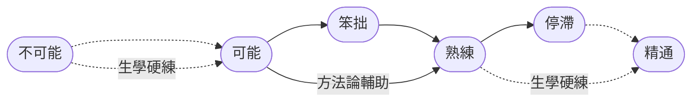
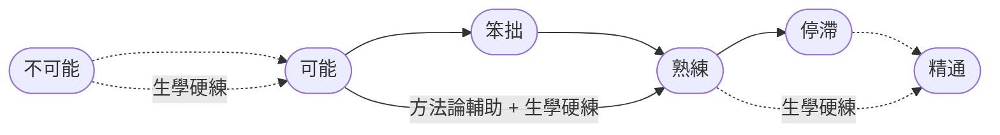

# 3. 生學硬練

無論我們做什麼事情，大腦都要協調很多的器官才能夠完成，它不僅要協調大腦外的各種器官，它還要協調自身內部的多個部位。無論是大腦外部的種種器官還是內部的各個部位，對大腦來說，都是大腦自身內部無數個**區域網**的聯動……

這些區域網都是逐步建立起來的 —— 每一個都是透過學習建立，透過大量重複使用強化。無論我們想要學什麼，第一步總是注意力集中地觀察 —— 呼叫任何必要的感官，視覺、聽覺或觸覺等等  —— 然後我們才開始嘗試……

幾乎總是一模一樣的流程：一旦開始**嘗試**，首先遇到的肯定是**不可能**，要經過**反覆嘗試**之後才會遇到**可能**，可能之後馬上遇到的是**笨拙**，再過一段時間才可能是**熟練**，而後可能是漫長的**停滯**，要經過很多刻意練習之後才可能**精通**……

這之中最重要且又最難的，當然是從**不可能**到**可能**的跨越，那可是 0 到 1 的突破。

核心的難度首先在於，**我們的觀察永遠不大可能完整**。舉個例子，我的母語之一是朝鮮語，所以我能發出齒齦顫音（[Voiced alveolar trill](https://en.wikipedia.org/wiki/Voiced_dental,_alveolar_and_postalveolar_trills)）。我家有個小朋友小名叫都都（dū dū），平日裡我逗他玩的時候，會故意用齒齦顫音喊他名字：

<audio controls><source src="/audios/dudu.mp3">Your browser does not support the audio element.</source></audio>

他們覺得很有趣，也想發出同樣的聲音。可在接下來的很長一段時間裡，他們就是發不出這個音。他們會反覆嘗試，但就是做不到。他們發出的可能是用嘴唇發出來的顫音 —— 只不過，在那一瞬間他們自己也知道那不是他們聽到的那種顫音。他們會繼續想辦法，換各種各樣的方式嘗試，但依然不行……

主要原因在於，他們看不到我的舌尖是如何在齒齦部位顫動的 —— 這就是無法完整觀察造成的難度。另外，我還真講不清楚我到底是怎麼做到的，我會誤以為我從小就會…… 實際上並非如此，當初的我和我現在的孩子一樣，剛開始怎麼也發不出這個聲音，很久之後才能發出那種聲音，但，我早就忘了自己其實是透過無數次嘗試才習得的，竟然誤以為那是一種天生的能力。

幸虧，在 Wikipedia 上，有這種齒齦顫音的完整且又系統的講解 —— 有 37 種語言的翻譯，其中，英文版是 [Voiced alveolar trill](https://en.wikipedia.org/wiki/Voiced_dental,_alveolar_and_postalveolar_trills)，中文版是[齒齦顫音](https://zh.wikipedia.org/?curid=274842)…… 不僅有詳盡的文字講解，還有慢動作影片演示：

<video controls width="480"> <source src="/videos/voiced-alveolar-trill.mp4" type="video/mp4"></source>Your browser does not support the video tag. </video>

現在，不僅觀察完整，方法論也很系統…… 可是，看過之後就能做到嗎？顯然還是不可能。大腦內暫時還沒有對應的可供呼叫的基礎功能性區域網，需要新建。並且需要的還不止一兩個，別看只是這麼小小的一個動作，實際上卻需要遠比想象多得多的基礎功能性區域網相互協調。新建連線新建網路就是需要時間，無論觀察完不完整、方法論存不存在，時間總是不可跨越。

那如何才能**突破**呢？

在我長大的年代裡，香港連續劇在中國大火，又由於那個時候可看的東西少，往往是一部劇全國都在追…… 在某部武俠劇裡，一個**武林高手**在鏡頭面前有個特寫，觀眾們看到的是，他的耳朵竟然會動！第二天，全班同學都互相問，你的耳朵能動嗎？大家都不行…… 在此之前，每個人的耳朵都沒動過，也沒想到過要動。過了幾天，有個同學說他**會動耳朵**了！大家驚訝地看他表演…… 再過幾天，班上很多同學都**學**會了怎麼**動**耳朵…… 當然，誰都說不明白**如何動耳朵**的**方法論**，都是一樣的措辭，“多試試就可以了”。

就是這樣 —— **多試試就可以了**。

在新疆，所有人在很小的時候就**學**會了**晃脖子**，那是一種其他民族的人少有能做出的動作。你去問他們，到底應該怎麼晃脖子，他們真說不清楚，就算偶爾有人說得很清楚，你也學不會…… 真的**學不會**嗎？肯定能學會，至於**方法論**麼，不是沒必要，而是它能起的作用並沒有想象得那麼大。

很少有人能**動鼻尖**，生活中，也沒有什麼這樣的 **“需求”** …… 但，兩個版本的《家有仙妻》的主演，無論是電視劇版裡的伊麗莎白·蒙哥馬利還是電影裡的妮可·基德曼都學會了這個動作 —— 怎麼學會的？跟 “動耳朵”、“晃脖子” 一樣，**“多試試”** 就可以了。

突破的關鍵在於**不停地嘗試**，一個方式不行就再換另外一個方式。反正新建連線新建網路就是需要時間，用什麼填滿那些時間呢？試錯 —— 這可是大自然用來進化的唯一有效策略。進而，為什麼可以不斷嘗試？又，為什麼願意不斷失敗不斷嘗試？因為它**肯定可能** —— 別人能做到，我也能做到……

這才是人生最兇悍的學習方式，我稱其為**生學硬練** —— 不斷試錯直至可能，不斷重複直至熟練：

> 因為肯定可能，所以才願意不斷嘗試；失敗很正常，換個方式接著嘗試，直到可能。

一切的學習，對大腦來說都一樣，最初 0 到 1 的突破，根本就沒辦法靠方法論解決，都只能靠生學硬練闖過去…… 等這一關過了，再把不可能變為可能之後，從笨拙走向熟練的過程中，方法論才開始有機會發揮作用。

可問題在於，方法論這個東西，即便有用，也常常並不能獨立起作用。舉個例子，我告訴你 t 夾在母音之間的時候要用彈舌音 t̬（[3.2.2.3.1](../sounds-of-american-english/3.2.2-td#_3-2-2-3-1-彈舌音-t)）—— 你當然瞬間能夠理解，甚至能夠記住，可是，下一次你開口說的時候，就能做到嗎？十有八九做不到。這種例子比比皆是，絕大多數英語語法知識點對第二語言習得者來說都是這樣的，考場上基本上都能把題做對，可是一開口說，一動手寫，就接二連三出錯，即便在出錯過後瞬間還能夠自我意識到……

很多重要的知識和技能就是這樣，知道根本沒有用，哪怕熟練也不夠用，必須精通才真正有用 —— 因為必須做到能夠下意識無意識都能做對的地步。大腦裡必須為了這個所謂**知道**要建立新的連線和網路，並且還要不斷強化，強化到一定地步才能夠下意識甚至無意識地正確處理這種情況 —— 熟練只是解除安裝了部分負擔，這需要極大量的重複，最好還是短期內足量重複；必須精通才能徹底解除安裝負擔，這還需要極大量的重複，最好還是短期內足量重複…… 只有精通，大腦才能徹底無負擔地同時做其他的事情……  說來說去，這不全都只能靠生學硬練嘛？

所以，生學硬練實際上貫穿著整個學習過程 —— 從始至終，任何時候都可能需要生學硬練，關鍵的時候尤其如此。之前的說法也應該調整一下了，所謂的生學硬練，應該是**不斷試錯直至可能，不斷重複直至精通** —— 而不只是熟練而已。

**生學硬練，原本是我們與生俱來的能力**。毫無疑問，在最初的幾年裡，無論什麼都是我們透過生學硬練掌握的。理論上來講，自然語言處理，是人類的大腦終生能夠處理的最高階最複雜的任務（沒有之一）；與之相應的，自然語言習得，顯然是我們這一生能夠遇到的最複雜最艱難但又必須完成的學習任務。但是，自然語言習得的最基礎部分，**語音塑造**和**記憶擴充套件**，卻能在還沒上學還不識字的過程中就逐步完成 —— 全靠生學硬練。

即便是到了很多所謂高階的領域，也還是一樣的。有人能手把手教，當然很好。但總有一些是身邊沒有人會的，那怎麼辦？看書，然後自己學、自己練。有沒有可能連書都找不到呢？當然。沒有人可以在身邊手把手教，書裡也找不到，那怎麼辦？到最後永遠都能仰仗的，再一次只能是生學硬練……

隨著時間的推移，絕大多數人竟然徹底忘記了自己曾經擁有過的生學硬練的本領。這背後的根源雖然有點微妙但也格外簡單。

每個人的時間都有限，剛開始的時候並不覺得，所以很難在意**效率**。隨著歲數的增加，過去的佔比越來越高，未來的佔比越來越少，效率的重要性就顯得越來越大，於是，越來越渴求一切可能會提高效率的方法論…… 越來越痴迷於方法論，甚至不惜欺騙自己去相信那些只是胡搞瞎搞但就是敢堅稱自己有效的所謂方法論。甚至，開始莫名其妙地鄙視生學硬練。與此同時，一切需要生學硬練的，都直接跳過，藉口說那需要一些自己沒有的天賦，所以自己永遠學不會 —— 倒是可以因此輕鬆原諒自己，以效率為名。

絕大多數人的問題只不過是，對自己要求太低，對世界要求太高。特別擅長糊弄自己，然後也習慣了糊弄世界…… 這個世界說實話倒也挺寬容，一般不會馬上反擊，可它總有忍不住的時候，萬一它反手一個耳光扇過來，沒有人能承受得住。

生學硬練也有技巧：**變著花樣不斷搞**。**試錯**，總是需要不斷地換新方式去嘗試，然而，**重複**，也需要不斷地換著方式重複，從各個角度、從各個層面去重複，變著花樣去重複。只要你肯不斷變花樣，原本看起來無比枯燥的生學硬練就會變得趣味叢生，其樂無窮。
