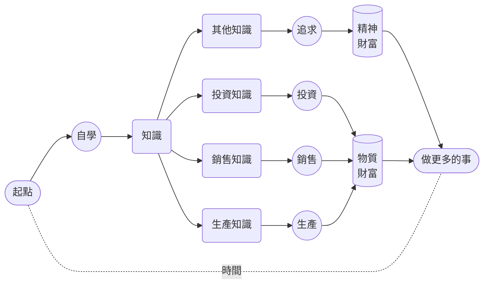

# 7. 自我鼓勵

自我驅動很好。一旦啟動，我們就好像正在行駛的汽車一樣。遇到顛簸、遇到彎道，它可能需要放慢速度，遇到陡坡的時候它可能需要加大馬力，甚至，它也有可能半路拋錨，需要重新啟動…… 而這一切，總是需要我們自己完成，雖然藉助外力並不是不可以，但，靠自己總是更有效率。

首先，我們需要不斷強化我們的動機，讓我們自己遇到**意外熄火**的時候更容易**重新啟動**。

**正面做法**是主動為我們的目標、行動及其成果從各個層面賦予更多更大的**意義**。負面做法**是呼叫我們的**恐懼** —— 對我們的大腦來說**恐懼永遠是最佳驅動力** —— 它會在潛意識層面不為人知地發揮巨大作用。

我們可以算一個**假賬**。

《財富的真相》裡我講：

> 我們這一生的所有財富，不管是物質上的還是精神上的，都是從自己的**時間**裡挖出來的……

既然，**時間就是生產資料**，那麼，用它幹什麼最划算？

到最後，選來選去，只有**自學**。雖然**練英語**，好像與**生產**、**銷售**、**投資**並未直接關聯，**學它幹嘛？** —— 我們先不說**賺錢**，先說說**省錢**。

從比例上來講，父母把絕大多數錢都花在孩子身上，尤其是**學習**上，這種現象在全世界都很普遍…… 所謂的**絕大多數錢**，從比例上來看，超過父母總體收入的 *60%* 並不罕見，高達 *80%* 也不稀奇。

當我們說**一年內至少一千小時的注意力投入**去**練英語**的時候，核心不只是**英語**本身 —— 因為，實際上你用同樣的方式練任何語言，或者練任何其它技能都一樣的 —— 在這過程中，學得更多、練得更多，體會得更深的，其實是**自學**，是**自學能力**的養成與發展。

如果你作為父母，竟然真正擁有自學能力，你的孩子哪怕僅僅透過耳聞目染也會擁有相對更強的自學能力，更何況，這個訓練本身，從一開始就可以全家人一起做。只要孩子有一定的自學能力，那麼，父母在孩子身上花的錢，大部分都會省下來，不僅父母省錢，孩子也會恰恰因此長出更多的本事。

父母拼命賺錢花在孩子身上的一個**副作用**或者**負作用**，就是孩子不斷**降智** —— 天下一切的**本事**，原本都只能在**遇到問題解決問題**的過程中**發展**出來，可是，絕大多數父母**拼命賺錢花在孩子身上**的結果，就是**遇到問題解決問題的**從來都是父母而絕對不是孩子。那些孩子原本應該遇到的問題，都被父母花錢解決了…… 至於是**真解決**了還是**假解決**了，往往並不知道 —— 真相總是很容易被掩蓋。

原本遇到問題的是孩子，那可原本是他們**長本事**的機會，結果，機會被剝奪的同時，問題卻實際上並未解決，但又誤以為已經解決了，問題的積累與誤解不斷擴大，甚至連幻覺也在跟著不斷擴大，到最後，神仙都沒辦法 —— 這絕對不是危言聳聽，最終的惡果，在絕大多數人 15 歲左右的時候就會顯現，就會爆發，並且只能一發不可收拾。
讓我們簡單算一筆賬。假設夫妻二人的年收入是 30 萬元人民幣…… 那麼，小學、初中、高中，12 年下來，平均每年在孩子身上花的錢，按 60% 計算，大約應該是 18 萬。這其中，大約 60% 是花在各種**校外輔導**上的 —— 基礎教育費用，事實上並不太高，因為全世界都一樣，高中畢業之前，畢竟絕大部分是**義務教育** —— 那麼，大約應該是 *10.8* 萬元，12 年下來，總計是 *129.6* 萬元…… 若是孩子有真正的自學能力，不說這些全都省下來吧，起碼其中的 *80%* 能省下來，算一下，就是 *103.68* 萬。

而你的**投資成本**呢？主要根本不是**錢**，也不僅僅是**時間**，而是**注意力**，只有時間成本沒有金錢成本的**注意力**。一年內至少一千小時的注意力投入** —— 並且，還是你們夫妻二人中的某一個就可以。所以，在金錢上，幾乎是零投入，而相對可能的收益呢？也許是 *103.68* 萬，並且，還相當於是**一年之內賺出來**或者**一年之內攢出來**的 —— 那可是年收入 30 萬的夫妻兩人不吃不喝三年都賺不到更攢不下來的錢！打工也好、創業也罷，這樣的投資收益很驚人吧？不算不知道，一算嚇一跳。

到最後，**投資收益**可不只是**一年幹出一百萬**那麼簡單。你變成了**雙語使用者** —— 甚至你的第一語言變成了英語。你也好孩子也罷，甚至你的另一半，都**長了見識**，親眼目睹了健腦的真相和效果，你擁有了真正的**自學能力**，他們也在不知不覺之中邁過了最大的門檻

如果你的孩子被你影響 —— 如果你真做了，他們必然全方位受到影響 —— 那麼，他們也會成為**多語使用者**，至少是**雙語使用者**。無數的研究表明，**多語使用者**相對有更強的思考能力、學習能力、解決問題能力、組織能力管理能力，甚至連罹患老年痴呆的風險都會因此降低很多。從大腦結構上來看，他們的灰質相對密度更高、體積更大，而白質覆蓋面積也更廣。

更為重要的是，無數調查都表明，**多語使用者**的收入比**單語使用者**高，終其一生，起碼會高出 *30%*…… 你估算一下你的孩子會有多少終生收入吧，再乘以 30%，那就是你用**一年內至少一千小時的注意力投入**可以為你的孩子額外賺到的金額…… 如果你再多生幾個，那你就再算算？

用金錢刺激自己，總是相當有效的。說來好笑，所謂的**用金錢刺激自己**，只不過是**算個假賬**而已。

不止金錢，還有很多。比如，你的一年努力，換來的肯定包括金錢買不來的**尊重**。人就是這樣，自己做不到的事情，別人做到了，只能選擇尊重。外人就算了，贏得另一半的尊重很重要，會使夫妻關係更為親密；贏得孩子的尊重更重要，父母的**尊重**若是透過行動**贏**來的，孩子就不存在什麼**叛逆** —— 天下一切的所謂**叛逆**，其實是**父母不值得孩子尊重**作為底色展現出來的光怪陸離而已，難道不是嗎？**幹上一年就能換來子女對自己終生的尊重** —— 請問，值不值？

如果你真的有什麼技能，能做到**輕鬆超越九成以上的人群** —— 訣竅很簡單啊，就是那句話，**一年內至少一千小時的注意力投入** —— 你整個人的**氣質**都會變的。首先來自於別人對待你的態度，而後來自於你的**自信** —— 關鍵在於，你的**自信**不可能是**自負**，因為它是有成績支撐的。沒有實際支撐的時候，自信很可笑，但，眾技傍身的你，由裡至外地自信，為什麼不呢？弄不好，你還得刻意低調呢 —— 為了讓別人更舒服一點。淡定的表情，聚焦的眼神，舒展的動作，從容的態度，這樣的神態其實都是自然發生的，裝是裝不出來的。外界越來越不重要，建設大腦皮層是你最喜歡乾的事情……

再讓我們看看如何呼叫**恐懼**作為底層驅動。其實很簡單：

> 想盡一切辦法讓自己相信練不好還不如死了算了……

大腦最怕死了，只要有死亡威脅存在，它就會不惜不斷抬高**安全閾值**，直至擺脫死亡威脅。這是我們完全無法改變的大腦執行機制，與其受其限制，不如反過來好好利用這個機制。把 “**\_\_\_\_ 練不好就得死！**” 這樣一個填空句式完成，列印出來放在每天一睜眼就能看到的地方，甚至列印多份，或者乾脆用這句話給[手機](/images/iPhone-wp.png)和[手錶](/images/iWatch-wp.png)都做個桌布…… 說來格外好笑，大腦很好騙的！只要重複次數多了，它就只能選擇相信。

除了不斷強化動機之外，我們還需要時不時進行**自我鼓勵** —— 不能總是等別人來鼓勵我們，對吧？自我鼓勵的最佳方式，可能會出乎很多人的意料，其實是**不擇手段地鼓勵他人** —— 簡單得很。

每個人都需要鼓勵，但，鼓勵總是稀缺的，所以，任何時候不擇手段地鼓勵他人都是正確的，多多益善。鼓勵的本質是推動被鼓勵者去完成**不相信**或者**不敢相信**的目標。你鼓勵他人一次，在對方尚未做到的情況下，他們對可能性依然是存疑的 —— 這就是為什麼大多數情況下大多數鼓勵並不起作用的根本原因。然而，你不斷鼓勵他人的結果是**自己重複的次數足夠多之後自己的大腦提前相信**了…… 你說，鼓勵他人的最大受益者到底是誰？鼓勵他人的最大受益者竟然是自己。
