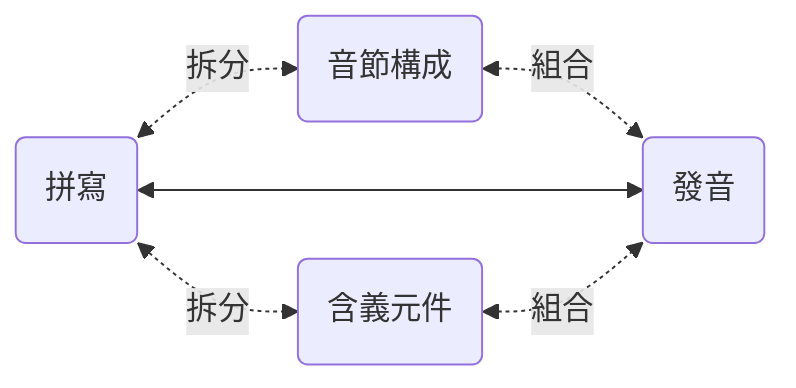
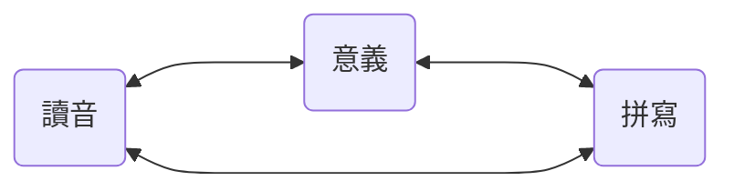

# 6.1. 有效記憶單詞

在第三章《音素詳解》中，在每個小節，針對每個音素都羅列出了 “常見拼寫” —— 這才是未來擴充詞彙的時候，最有效的輔助記憶手段和工具。

英文的詞彙構成，主要分為 “表音” 和 “表意” 兩種。

*apple* ˈæp.əl 就是一個表音構成的詞彙，這是兩個音節的詞彙，app 對應著第一個音節 ˈæp，le 對應著第二個音節 əl。所以，記憶它的時候，不是一個字母一個字母地背，說，“*a、p、p、l、e…… apple!*”。而是，æ 對應著 *a*；p 的拼寫是兩個疊加的 *pp*，而後是 *le* 讀作 əl —— 這樣的拼寫很常見，比如，*double*, *impossible*……

而 *impossible* ɪmˈpɑː.sə.bəl 這個詞裡，就有表意的構成，*im*- 是個常見詞頭（prefix），和 *un*- *ir*- 一樣，表示否定的含義，*possible* 是 “可能的”，*impossible* 就是 “不可能的”。進而，*possible* ˈpɑː.sə.bəl 就可以把它完全當作只有表音構成的詞彙，*po* 讀作 ˈpɑː，或者反過來，ˈpɑː 寫作 *po*，*ssi* ⭤ sə，*ble* ⭤ bəl…… 反正不應該是 “*p、o、s、s、i、b、l、e…… possible!*”…… 生硬地按順序記住 7 個字母，顯然不如 “只記三個音節” 來的容易 —— 這其中，需要多注意一下的，不過是 ss（double s）而已。

另外，常用詞彙中其實有不少是 “組合詞彙”（*compound words*），各個組成部分也都是 “表意” 的。比如 *classroom* ˈklæs.ruːm , *doorbell* ˈdɔːr.bel , *handwriting* ˈhændˌraɪ.t̬ɪŋ , *sunshine* ˈsʌn.ʃaɪn , *upstairs* ʌpˈsterz  等等。

詞根詞綴，尤其是那些來自於拉丁語的詞根詞綴，在詞彙量沒達到一定程度之前，實際用處不大 —— 但，到了一定地步，比如，詞彙量超過 5,000 的時候，在這樣紮實的基礎上，稍微研究一下詞根詞綴，對快速且大量地做大詞彙量是很有幫助的。

舉個例子，*ichthyosaur* ˈɪk.θiə.sɔːr，這個一看就知道並非常用的詞彙，其實很簡單，先從表音構成去看，ˈɪk.θi.ə.sɔːr —— 劍橋詞典把它劃分成了 4 個音節…… 但感覺上，第二第三個音節可以合併，ˈɪk.θiə.sɔːr，*ich* ⭤ ˈɪk, *thyo* ⭤ θiə, *saur* ⭤ sɔːr…… 而從表意的角度去看呢？前半部 *ichthyo*- 的意思是 “與魚有關的”…… 後半部 -*saur* 是什麼意思呢？各種恐龍的 “龍” 都是 -*saur* 結尾，於是，這個詞的意思是 “魚龍”……

記憶詞彙的最樸素最有效方法，就是把它的拼寫、讀音和意義聯絡起來 —— 這原本是文字本來的結構和意義。

除此之外，其他的任何所謂的 “方法”，都不僅無效，甚至只有副作用，弊大於利。比如什麼 “諧音記憶法” 或者 “趣味記憶法” 什麼的，它們都違背大腦對語言文字的基本工作機制，根本不可能提高效率，只會增加不必要的負擔 —— 雖然有時候覺竟然覺得有點意思……

人們失敗的原因很簡單，他們總想 “更省事兒一點”。坐在那裡只用眼睛看，既不動口也不動手，也因此實際上更少動腦。只呼叫一個器官和同時呼叫多個器官是不一樣的，前者好像更省事兒，可實際上由於腦力呼叫太少，導致的結果是 “效果幾近於零”。

學外語的人十有八九失敗。很多失敗的人都曾經去問過老師，“老師，我背單詞不記發音行不行？” “老師，我背單詞不記拼寫行不行？” 這種荒謬至極的問題問出來，並不是想要什麼答案，只是想要一個 “偷懶認證”，給自己的偷懶找個背書…… 還別說，還真有老師說 “可以！” 因為真的有相當數量相當比例的老師，透過這種方法獲得更多來自學生的好感，進而提高自己的收入……

剛開始的時候，記憶單詞無論如何都是吃力的。這是一個真誠的忠告，誰不信誰吃虧，愛信不信：

> 千萬不要嘗試用任何手段去提速……

—— 因為事實上誰都不可能提速，無論什麼手段都不可能提速…… 真正提速的方法只有一個，**積累**。

擴充詞彙，是有**加速度**的過程 —— 可以越來越快…… 可是，在最初的時候，速度很低，加速度為零，所以總是感覺超級吃力。然而，詞彙之間是有關聯的，對大腦來說，一個生詞與已有的詞彙關聯越多，越容易記住。也就是說，已有詞彙量越多，新詞可能與它們產生的關聯越多，所以才越來越容易。當你的詞彙量超過三五千的時候，你就會感覺很多生詞幾乎看一眼就記得住，無論是拼寫還是讀音還是其意義甚至其用法 —— 整個看似來是個**複利曲線**一樣有**越來越大的加速度**的過程。

倒是有個竅門。**直接背例句**…… 對大腦來說，“多朗讀幾遍例句” 遠比 “只把力氣花在某一個單詞或者片語上” 來得更為輕鬆。在語言方面就是這樣，你做得越多，對大腦來說越輕鬆，反過來，你做得越少，所謂 “省事兒” 逐步形成的，對大腦來說只能是不可逾越的障礙。

進而，最靠譜的擴大詞彙量方法：**精讀**。找到自己真正感興趣的書（小說類、非小說類各幾本），遇到生詞就查，逐一消滅 —— 每本書都要讀若干遍（所以一定要選自己真迷戀的書）…… 讀著讀著，詞彙量就大了，句法障礙就消失了，理解能力就提高了，閱讀速度就飛快了…… 各種語言都是這樣的。哪怕是我們的母語，我們對母語的掌控能力，也是這麼練出來的 —— 學校裡的語文課和語文老師，從來都幫不上什麼忙…… 說點刻薄的話，這些語文老師啊，他們的唯一作用就是在考試裡給絕大多數學生設定奇怪的障礙。