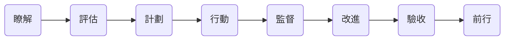

# 以教促學

我經常慨嘆，“教是最好的學習方法” —— 這顯然出自我的人生經驗。機緣巧合，我在 28 歲那年去新東方應聘，在那裡教書七年之後離開。隨後的日子裡，雖然我不再是一個傳統意義上的 “老師”，但，教學與分享再也沒有停止過，無論是寫書、講課，還是日常與家人或者親戚朋友之間的溝通，對我來說，本質都一樣，都是 “教育工作” —— 請注意，更多的應該是 “自我教育工作”。

“角色” 對一個人的行事方式有深刻且又難以捉摸的影響。天下的父母跟孩子爭辯的時候，都說過一樣的話，“等你當了爸媽就知道了” —— 這就是 “角色” 不同導致的思考方式不同，乃至於連正常溝通都無法進行的經典案例。創業者也經常有相同的慨嘆，“自己當年打工的時候誤會老闆的地方太多了……” 只有等到有一天自己竟然當上了老闆，才知道不被理解甚至被誤解的痛苦和尷尬。

想象一下有人過來問你一個課本里出現過的單詞究竟是什麼意思，然後你竟然想不起來了…… 你是學生的話，你會有什麼心理負擔嗎？“見過甚至背過但想不起來了” 這不是大多數學生的實際情況嗎？可如果你是老師呢？無論是什麼原因造成的，你都會因此臉紅，尷尬，甚至惱羞成怒。不同的角色，感受不同，壓力不同，責任不同，義務不同 —— 不同的地方實在是太多了。

回頭看，如果我沒有在新東方教書的經驗，我不可能像今天這樣在英文閱讀方面如此自如，因為當年我一開始教的就是閱讀…… 如果當年不是因為部門裡缺寫作老師，我硬著頭皮背課救火，後來教了好多年的寫作，連我今天的中文寫作水平都可能會大打折扣，甚至乾脆有可能在起點上就已經落敗。

學生之中，優等生是那種記得住老師強調過的重點的學生，中等生是那種靠前頻繁要求老師劃重點的學生，差等生是那種老師平日裡強調過、考前劃過重點也沒用的學生…… 所以，在我自己還當學生的時候，語法書是絕對不可能看完的，書架上不是沒有過語法書，但，都是新的 —— 也許前 30 頁還有過翻過的痕跡？

等我當了老師，而不再是學生，哪怕僅僅是為了背課，都要一遍一遍地翻語法書，一本里找不到合適的例句或者答案，就要再多翻幾本，到最後，幾本語法書都被翻爛了，腦子裡裝了很多當學生的時候斷然不會保留的資訊。不僅如此，平時閒著沒事逛書店，只要看到有新的語法書出版，都會不由自主地拿起來翻翻，判斷一下是否值得買回去作為參考。顯然，我自己還當學生的時候，斷然不會如此。

當好老師，最基礎的要求就是 “系統全面”。為了追求極致，到最後就要一遍又一遍地嘗試著 “掃清一切犄角旮旯”，任何遺漏都可能成為羞恥 —— 尷尬且又不幸的是，你越認真，你臉皮越薄，而那些不小心犯下的錯誤就會成為越大且越不可承受的羞恥。所以，對老師來說，“重點” 常常是反過來的，“越是犄角旮旯的，越是容易被忽視的，才是真正不可或缺的重點”，因為它們才是造成教師羞辱的重點。

我人生出版的第一本書是《TOEFL 核心詞彙 21 天突破》。出版社送來樣書的時候，我還挺高興，翻了翻之後合上，扣在桌子上，然後就一眼掃到在封低的頂部有一串英文字母，沒反應過來，再定睛一看，是 “TUO FU HE XIN CI HUI 21 TIAN TU PO” —— 竟然是漢語拼音！我當場臉就臊紅了，再拿起來翻翻印數，首印 10,000 冊！這就是我得丟 10,000 次臉！如果我不是老師，不是教英語的老師，我會因此臉紅嗎？我猜不會的。我更不會因此情緒激動。我在陽臺上抽了好幾顆煙才平復了情緒，然後拿起電話打給編輯，說，你們最好下一次印刷的時候，把這行拼音去掉吧，畢竟這是一本英文詞彙書……

多年的教學經驗，到最後產生的最大效果，實際發生在自己身上 —— 感覺 “重新上了一次學” —— 甚至，真真切切地覺得 “過去就是上了個假學”。甚至，連當年和很多人一樣共同經歷過的那麼多年稀稀拉拉的所謂 “學英語”，回頭看的話，就好像是 “學了個假的英語”，或者 “假學了個英語”。而那用 62 分換來的 “全國大學四級英語證書”（CET-4）就是自己當年的確 “傻乎乎” 的明確且又不容置疑的證據。

更為重要的是，整個學習方法發生了天翻地覆的變化，乃至於想到當年自己作為一名普通學生的時候那些所謂的 “學習”，就覺得實在是太不靠譜了，甚至，乾脆是可笑，怪不得當時是一個事實上的學渣……

“自學” 的核心難點在於 “自主意識”。

至於學習的 “流程”，事實上相當固定且沒有任何秘密，任何受過正常義務教育的人都經歷了無數回，常見的環節無非如下：

只不過，這些環節中的大多數，學生要麼不參與，要麼被動參與，從未完整經歷過。對一個科目或者某項技能的全面瞭解，被認為是專家才能做的事情，連學校裡的老師都不配。所以，寫教材的那些人才是全程參與 “瞭解”、“評估” 與 “計劃” 的角色。學校裡的老師，從 “實施” 開始參與，他們按 “計劃”（即，教材裡的章節安排，以及學校裡的課程表）進行講解，留作業，以此完成 “行動”、“監督” 與 “改進”，而後透過大大小小的 “考試” 完成所謂的 “驗收”…… 然後並不是很嚴肅地畫一條線，過了這個線就是小型考試的 “及格”，或者升學考試的 “錄取” —— 至於到底怎樣，事實上沒人特別關心，然後，稀裡糊塗地繼續前行，剩下的，只能交給隨後的生活再慢慢展露真相……

我在改造（或稱為 “顛覆”）自己的 “**自學系統**” 的時候，最重要的一件事就是在每個我能想到的環節上 “**強加自主意識**”。哪怕是那些被認為 “自己肯定做不了” 的，也要強制自己做一做，哪怕做的不好也沒關係，做得好不好都是經驗，經驗是可積累的，經驗豐富從來都不是一蹴而就的。

所以，無論學什麼，都會先花上相當長一段時間對那個科目、技能或者領域從各個方面去嘗試著瞭解，明知道那隻能是 “泛泛的瞭解”，也要硬著頭皮做。“全面瞭解”、“細緻評估” 而後 “詳實計劃”，這些都是教材編撰者應該做的事情，但，這並不意味著說我是學生，我就沒責任、沒義務、沒能力、甚至不應該去了解或者思考。我的選擇是，必須瞭解，必須思考 —— 這就是 “強加自主意識”。

“計劃” 也一樣，教材或老師給的，往往是一個 “通用計劃”，可 “通用” 的意思就是 “不一定適用所有人”，所以，也需要 “新增自主意識”，或者乾脆 “強加自主意識”，必須要主動思考，想一想是不是要增加一些任務？或者，是不是可以因為時間精力暫時忽略一些任務？又或者，我如何才能以更快的效率完成任務？沒有人督促，就不 “行動”，沒有人 “監督”，就做不出任何 “改進”，沒有人 “驗收” 就敷衍了事，沒有人帶著，就駐足不前 —— 這些都是缺乏自主意識的結果。

說來好笑，絕大多數人其實是一點一點喪失了 “自學能力” 的。剛出生的時候可不是這樣。嬰幼兒沒有計劃也要行動，沒有監督也會重複，沒有驗收也會改進，沒有人帶著也會成長…… 從這個角度望過去，自學能力的一切基礎，其實都是與生俱來的，或者與生俱來地帶著相應的潛質，然後，在成年過程中一點一點喪失，直至消失殆盡 —— 學校的一個副作用就是，替學生做的太多，乃至於那部分能力學生在學校裡用不著，於是，只能逐步用進廢退 —— 小學六年、初中三年、高中三年，本科四年，這一口氣十六年過去，自主意識竟然還在，天生的自學能力竟然還保持完好，那可真的是奇蹟了吧？

“**重新定位自己的角色**”，是 “強加自主意識” 的最簡便方法。把自己定位成 “自己的老師”，那麼，所有老師應該乾的事情，都是你自己就要幹好的事情，畢竟，你的學生是你自己，那你可真得負責，也只能你自己負責。又由於其實是同一個人，所以，老師該乾的都幹好了，學生怎麼可能幹不好呢？—— 太難了吧！再說，這壓根就不是難不難的問題，乾脆是沒可能的問題。

比較諷刺的是，越是成年人越是難以調整角色。越是成年人越是傾向於認為，“做老師可得有資格”，或者，“不是隨便誰都可以當（我的）老師的”，等等等等，不一而足…… 可是，只要冷靜看一下這世界的真實情況就知道了 —— 老師也是一點一點成長的吧？無論是誰，都不可能一上來就是高階教師、超級教師、明星教師、無敵教師…… 再說，要是 “給自己當老師” 沒自信，那就先 “給自己當個助教” 吧，再不行給自己當個 “學校小組組長” 吧…… 反正總有可以起步的地方。

無論如何，只當學生這一個角色肯定不行，反正必須想辦法 “**不斷強加自主意識**”。另外，**有一個此生不離不棄的 “專屬老師” 也是一種 “特權” 吧？**想要學 “好”，先認真 “教” 吧，這事兒無論如何都真的值得做一輩子。

與此同時，之前已經提到過，有了 “人工智慧” 之後，又不一樣了，“最好的老師是人工智慧”，我們既是 “學生” 又是 “助教”。重新審視之後，發現其實沒有什麼變化，只不過是 **所有 “演示” 的環節全部交給 “人工智慧” 了**，並且不用擔心它不夠權威不夠全面 —— 尤其是在 “語言學習” 方面 —— 而後，自己要做的事情還是那一套：

所有這些環節，作為 “學生” 都是 “**被動**” 地做的，但，作為 “助教” 則必須 “**主動**” 做這些事情，不僅要 “主動” 做，還要做得 “**足夠全面**” —— 這就是 “自學者” 和 “其它學習者” 最不一樣的地方。從這個角度望過去，那些所謂的 “學渣”，其實也很努力，也沒少幹活，但，基於他們的認知，他們只是因為不知道所以才少做了很多其實其實值得做必須做的事情；或者換一種說法，他們只是 “缺一個自己的專屬老師”（或者 “教練” 或者 “助教”）而已 —— 他們因為無知，所以都不知道自己放棄了 “特權”。

作為父母，最好對這樣的差異有著深刻的瞭解，說實話，也沒多複雜，也很容易講清楚…… 於是，這就不再是什麼 “智商” 問題，“天分” 問題，這完全是簡單的 “複述” 問題 —— 把這個道理越早複述給自家孩子越好，不僅如此，還得逼著孩子反覆複述，直至將這麼簡單卻又那麼重要的道理刻到腦子裡。這一點點的差異，經過日積月累，會造成天壤之別，到最後，別人可能要用 “智商不夠” 或者 “天分不足” 去解釋他們比較之後的窘境。可你卻清楚地知道，一切是從什麼時候，從哪裡開始的……（在《專注的真相》裡，我們專門講解過 “用 ‘複述’ 為自己 ‘洗腦’ 的有效方法”……）