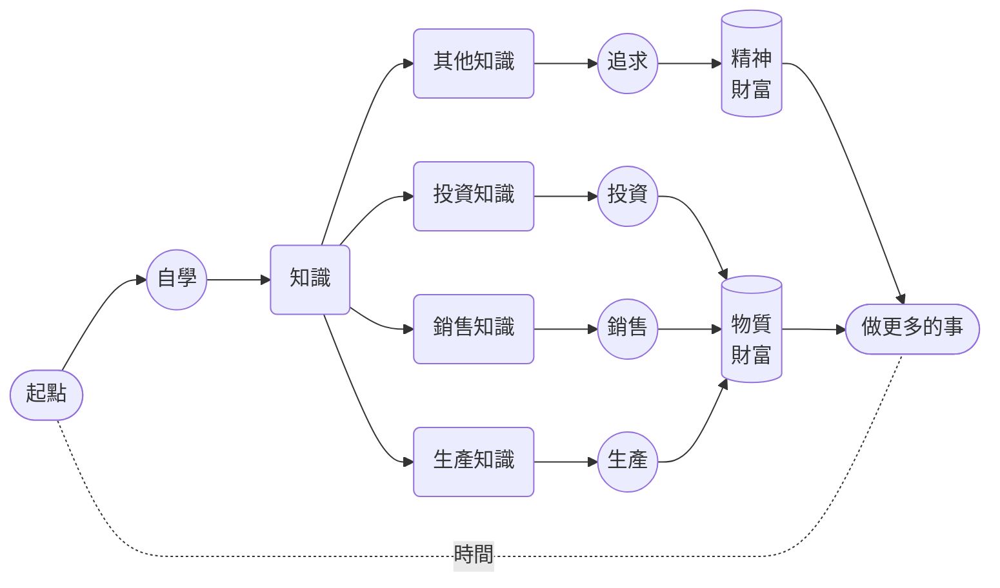

# 金錢至上

說來搞笑。儘管很多人不願意承認，但，“金錢” 對每個人來說的確都是最強烈的 “動機” 來源或者外部 “刺激”，幾乎沒有例外…… 所以，我們也別迴避了，直面這個問題好了。

《財富的真相》裡我講：

> 我們這一生的所有財富，不管是物質上的還是精神上的，都是從自己的時間裡挖出來的……

既然，**時間就是生產資料**，那麼，用它幹什麼最划算？

到最後，選來選去，只有 “自學”。雖然 “學英語”，好像與 “生產”、“銷售”、“投資” 並未直接關聯呢，“學它幹嘛？” —— 先不說 “賺錢”，先說說 “省錢”。

之前提到過：

> 從比例上來講，父母把絕大多數錢都花在孩子身上，尤其是 “學習” 上，這種現象在全世界都很普遍…… 所謂的 “絕大多數錢”，從比例上來看，超過父母總體收入的 60% 並不罕見，高達 80% 也不稀奇。

當我們說 “**一年內至少一千小時的注意力投入**” 去 “學英語” 的時候，核心不只是 “英語” 本身 —— 實際上，你用同樣的方式學任何語言，或者學任何其他技能都一樣的 —— 在這過程中，學得更多，練的更多，體會更深的，其實是 “自學”，是 “自學能力” 的養成與鍛鍊。

“自學能力” 原本並不高階，小朋友很小就具備自學能力，甚至相當天然，因為他們無論什麼都肯 “生學硬練”。然後，這也是在正確的引導下，在恰當的實操過程中，可以不斷鍛鍊增強這種能力 —— 可問題在於，基於這樣那樣的原因，所謂的 “教育” 竟然統一且又成功的作用是，“消滅掉了絕大多數人的自學能力”…… 嗚呼哀哉。

當然，無論 “生學硬練” 多麼厲害，僅靠它也不行，要在它的基礎上搭建一個完整的 “自學系統” —— 這就是父母必須為孩子做的事情了，因為這件事情不應該也不可能 “外包”。學校、培訓機構，以及各類教職人員，最不在意甚至也壓根不想教的就是 “自學能力” —— 否則，大家都能自學了，他們怎麼賺錢呢？這是一種 “有意無意的合謀”，正如全世界的醫生們都一樣，都故意用別人認不出的字型書寫處方一樣。

其實，只要有了一定的 “自學能力”，那麼，父母在孩子身上花的錢，大部分都會省下來，不僅父母省錢，孩子也會恰恰因此長出更多的本事。

父母拼命賺錢花在孩子身上的一個 “副作用”（或者 “負作用”）是孩子不斷 “降智” —— 天下一切的 “本事” 都是在 “遇到問題解決問題” 的過程中 “發展” 出來的，可是，絕大多數父母 “拼命賺錢花在孩子身上” 的結果就是 “遇到問題解決問題” 的從來都是父母而絕對不是孩子。那些孩子原本應該遇到的問題，都被父母 “花錢解決” 了…… 至於是 “真解決” 了還是 “假解決” 了，不知道，真相被掩蓋了而已。

原本 “遇到問題” 的是孩子，那可原本是他們 “長本事” 的機會，結果，“機會” 被剝奪了，“問題” 卻實際上並未解決，但又誤以為已經解決了，問題的積累和誤解甚至幻覺的積累不斷擴大，到最後，神仙都沒辦法 —— 這絕對不是危言聳聽，最終的惡果，在絕大多數人 15 歲左右的時候就會顯現，就會爆發，並且只能 “一發不可收拾”。

讓我們簡單算一筆賬。假設夫妻二人的年收入是 30 萬元人民幣…… 那麼，小學、初中、高中，12 年下來，平均每年在孩子身上花的錢，按 60% 計算，大約應該是 18 萬。這其中，大約 60% 是花在各種 “校外輔導” 上的 —— 基礎教育費用，事實上並不太高，因為全世界都一樣，高中畢業之前，畢竟絕大部分是 “義務教育” —— 那麼，大約應該是 10.8 萬元，12 年下來，總計是 129.6 萬元…… 若是孩子有真正的自學能力，不說這些全都省下來吧，起碼其中的 80% 能省下來，算一下，是 103.68 萬。

“啟動任務” 中的 “每天至少三小時”，一定攔住了很多人 —— 因為絕大多數人一輩子都沒那麼幹過，沒有過那樣乾的完整經驗，當然也就從來都不可能知道那麼幹的效果是怎樣的，只是 “憑直覺” 認為困難，以為不可能…… 殊不知，那恰恰就是 “學了個假習過了個假日子” 的根本原因。

“學英語” 固然是目標之一，更重要甚至最重要的是，你作為父母，“親自展示一下效果” —— 學什麼都是這樣的。用同樣的方式 —— **每天至少三小時，一年內至少一千小時的注意力投入** —— 樂器、歌舞、書法、棋藝，任何體育專案，無論是田徑還是球類，自然語言，無論是母語還是外語，人工語言，無論是校內的數理化，還是校外的程式設計…… 都一樣的，都能做到自然超越九成以上的人群。

而你的 “投資成本” 呢？主要根本不是 “錢”，也不僅僅是 “時間”，而是 “注意力”，只有時間成本沒有金錢成本的 “注意力”。“**一年內至少一千小時的注意力投入**”，並且，還是你們夫妻二人中的某一個就可以。所以，在金錢上，幾乎是零投入，而相對可能的收益呢？103.68 萬，並且，還相當於是 “一年賺出來” 或者 “一年攢出來” 的 —— 那可是年收入 30 萬的夫妻兩人不吃不喝三年都賺不到更攢不下來的錢！打工也好、創業也罷，這樣的 “投資收益” 很驚人吧？不算不知道，一算嚇一跳。

到最後，“投資收益” 可不只是 “一年幹出一百萬” 那麼簡單。你變成了 “雙語使用者”，你也好孩子也罷，甚至你的另一半，都 “長了見識”，親眼目睹了 “真學習” 的真相和效果，你擁有了真正的 “自學能力”，他們也在不知不覺之中邁過了最大的門檻 —— 從不知道 “真學習” 到見證了 “真學習” —— 然後走在 “獲得自學能力”、“養成自學習慣” 的路上……

其實，這個 “賬” 還沒算完。

如果你的孩子被你影響 —— 如果你真做了，他們必然全方位受到影響 —— 那麼，他們也會成為 “多語使用者”，至少是 “雙語使用者”。無數的研究表明，“多語使用者” 相對有更強的思考能力、學習能力、解決問題能力、組織能力管理能力，甚至連罹患老年痴呆的風險都會因此降低很多。從大腦結構上來看，也相對灰質相對更厚，白質覆蓋面積更大。

更為重要的是，無數調查都表明，“多語使用者” 的收入比 “單語使用者” 高，終其一生，起碼會高出 30%…… 你估算一下你的孩子會有多少終生收入罷，再乘以 30%，那就是 你用 “一年內至少一千小時的注意力投入” 可以換來的金額…… 如果你再多生幾個，那你就再算算？

用金錢刺激自己，常常是最有效的。說來好笑，所謂的 “用金錢刺激自己”，常常只不過是 “算個假賬” 而已。

當年我為了進新東方教書，就要考 TOEFL/GRE，當年的我還沒有今天對教育或者考試這麼清楚的認知，也傻呵呵地去背單詞 —— 因為那時候大家都那麼說麼，說是怎麼也得搞個 2 萬的詞彙量…… 搞唄。不就是 “每天至少三小時” 麼？—— 當然，根本就沒用上一年，三個月就搞定了。

我怎麼刺激自己的？一樣的，“算個假賬” 而已。那時候謠傳新東方老師年薪百萬，我想著說，不用那麼多，稅後 50 萬足夠了。一算，樂了，搞定 2 萬個單詞，就有稅後年薪 50 萬的可能，那麼，一個單詞就值 25 塊錢啊！還是 “每年至少 25 塊”！換算到字母為單位，恨不得 “一個字母就好幾塊”。

我找來幾個隨手貼，在上面寫上 “25 元/單詞”，分別貼在家裡我經常出現的地方，床頭，鏡子，桌子，面對馬桶的牆上…… 確保自己時不時就能看到。這種 “自欺欺人” 真的很管用，從那一刻開始，真心覺得每個單詞都長得很好看，短的覺得幹練，長的覺得苗條，意義特殊的覺得精緻，拼寫困難的覺得別緻 —— 真不是在誇張或者開玩笑，那是真實的感受。每天最後複習一遍的時候，感覺就是在 “數錢”，自己跟自己說話，今天搞定 200 個單詞，不錯，這下賺了 5,000 呢……

我們的大腦很神奇，但，它也很傻的，怎麼騙它都行 —— 只要是它最關注的東西，你往上靠得無論多麼牽強，它都信。有時候我覺得，它之所以那麼神奇，就是因為它那麼傻。

更重要的是，不要小瞧 “**一年內至少一千小時的注意力投入**” 這種用一句話就能說完的方式進行的 “真學習”。它會讓你贏得真正的尊重 —— 人就是這樣，自己做不到的事情，別人做到了，只能選擇尊重。外人就算了，贏得另一半的尊重很重要，會使夫妻關係更為親密；贏得孩子的尊重更重要，父母的 “尊重” 若是透過行動贏來的，孩子就不存在什麼 “叛逆” —— 天下一切的所謂 “叛逆”，其實是 “父母不值得孩子尊重” 作為底色展現出來的光怪陸離而已，難道不是嗎？

**“幹上一年” 就能換來子女對自己終生的 “尊重”** —— 值不值？

如果你真的有什麼技能，能做到 “輕鬆超越九成以上的人群” —— 訣竅很簡單啊，就是那句話，“一年內至少一千小時的注意力投入” —— 你整個人的氣質都會變的。首先來自於別人對待你的態度，而後來自於你的 “自信” —— 關鍵在於，你的 “自信” 不可能是 “自負”，因為它是有成績支撐的。沒有實際支撐的時候，“自信” 很可笑，但，眾技傍身的你，由裡至外地自信，為什麼不呢？弄不好，你還得刻意低調呢 —— 為了讓別人更舒服一點。淡定的表情，聚焦的眼神，舒展的動作，從容的態度，這樣的神態其實都是自然發生的，裝是裝不出來的。外界越來越不重要，建設大腦皮層是你最喜歡乾的事情……

我經歷過很多次 “一年內至少一千小時的注意力投入”。其中最搞笑的是 “健身”。普通人健身，金錢投入相對多一些，畢竟健身房的年費和教練的輔導費都挺貴，時間投入真的相對很少，每週 3 次，一年下來也就 160 次左右，每次連路上的時間都算上也不過 2.5 個小時，一年下來其實只投入了 400 個小時…… “注意力” 投入更少，我的方法是 “花錢請教練”，所以，其中一般的時間其實是 “心不在焉”，腦子裡 “胡思亂想”，全靠教練站在邊上幫自己數數、打氣、看護……

健身，只要持續兩個月以上，就可以見到效果，半年就效果驚人 —— 所有人都看得到，原來的衣服全都得扔，胸圍、臂圍、腿圍都變大了，腰圍變細了，體態筆挺了，穿衣服的效果都不一樣。就算原本長得醜，也因為體態變了所以更精神了。若是竟然跟同事去海邊，或者去泡個溫泉，那就完全是 “鶴立雞群”。周遭的人對你的態度所發生的變化，難以用語言描述。我老婆的玩笑話就是，“真是不錯呢，感覺不用離婚就換了個老公……” 這當然不是用錢就可以換來的東西 —— 尊重這個東西，用錢買不到。

不僅要 “算算賬”，哪怕是 “假賬”，還要換一下 “方向”。過去，當年你上學的時候，總感覺自己其實 “為了父母” 學習，後來懂事了，即便是 “假學習” 也知道是 “為了自己” —— 現在，給你換個 “方向”，“為了孩子” 學習，“為了家庭” 學習。作為父母，你可能會突然發現，這一次真心 “不敢做假” 了，是吧？

李笑來一臉壞笑 —— 李笑來這是在對著自己壞笑。我用英語很多很多年了，甚至到最後，英文閱讀速度比中文還快 —— 沒辦法，每年下來，讀的所有的書，都是英文的，文章也一樣，絕大多數是英文的…… 可是口語呢？很差，為啥？潛意識裡覺得沒啥用，反正生活裡也沒啥跟人說英語的需求。那現在都五十多了，為什麼 “突然” 打起精神練了呢？為了孩子，只為了孩子。

-----

請不斷羅列你自己的動機來源……

|      | 正面 | 負面 |
| ---- | ---- | ---- |
| 物質 |      |      |
| 精神 |      |      |

